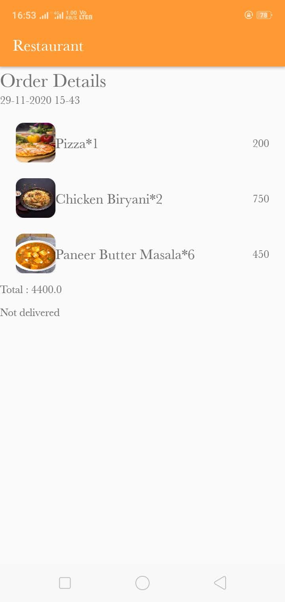
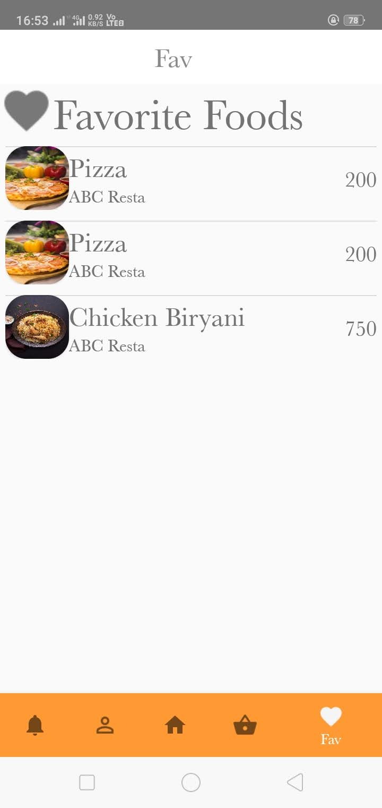
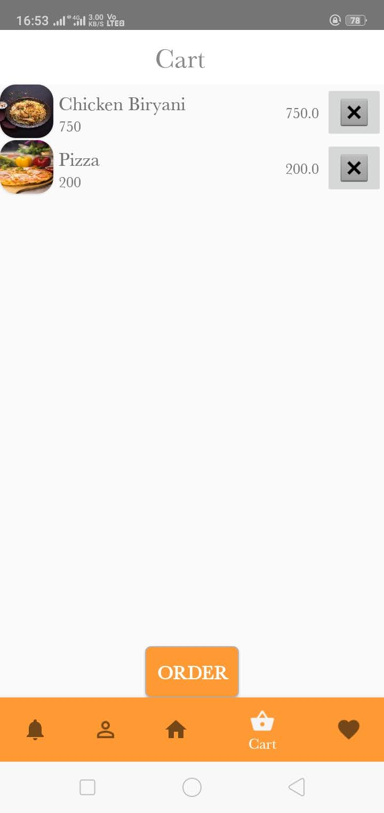
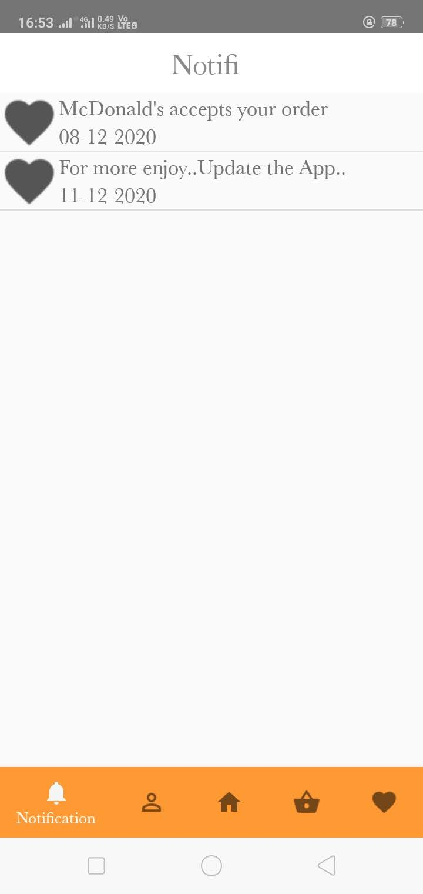
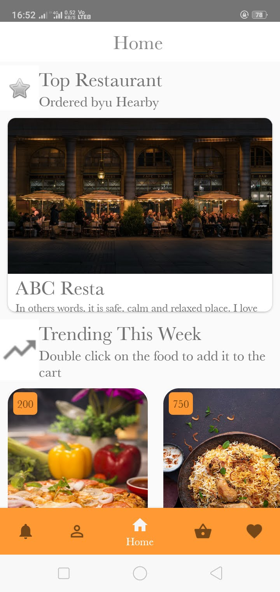
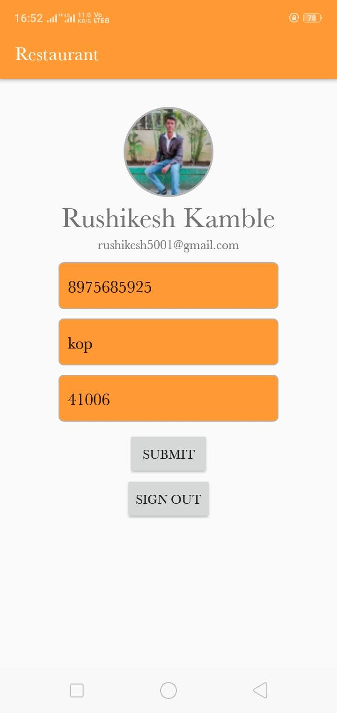
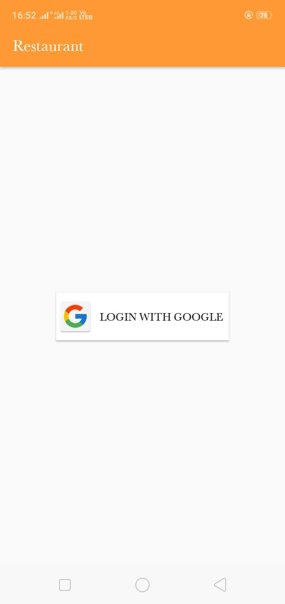

# restaurants-app-frontend-in-flutter-with-firebase
<h3>Main Page With Frames:</h3>

It is my personal project, this app shows nearby restaurants and menu cards with ratings.

 

 
 
 

 

 

 
